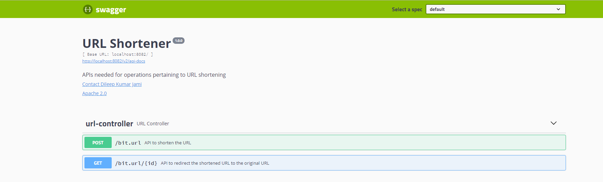
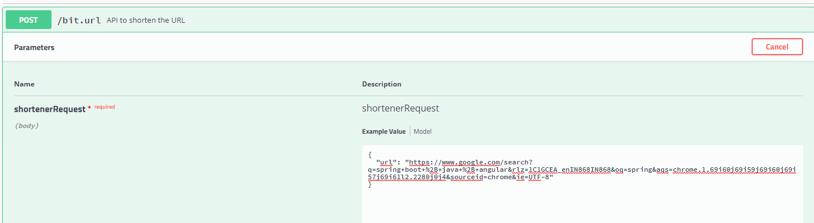
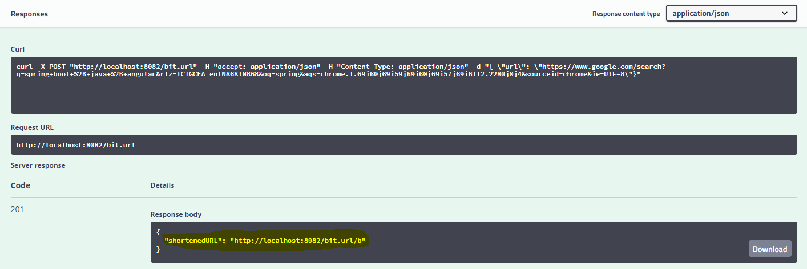

# URL Shortener

## Aim

This URL shortener basically shortens lengthy URLs to a tiny URL which makes it easy to share it
 to others

## Pre-requisites

This project needs the following dependencied
- Java 8
- Maven >= 3.2.5 
- Spring boot
- H2 Database (An in-memory database)
- Swagger (for documenting the APIs)

## Build locally

- Run the command below to generate the build
> **`mvn clean install`**

## Starting the application
 
- Run the command below to launch the application

 > **`mvn spring-boot:run`**

- Now, open the swagger page to find the APIs [here](http://localhost:8082/swagger-ui.html)

The swagger page looks like below:

## Using the APIs

- Use the **POST** API with the url to be shortened as the request body like shown below:

- On getting a successful response as shown below, copy the **_shortenedURL_** and paste it in
 the browser which would redirect to the original lengthy URL
 
 

 